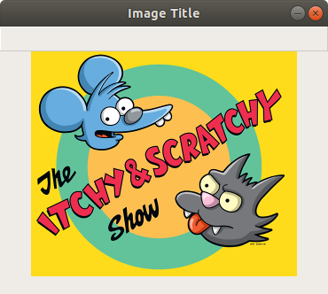
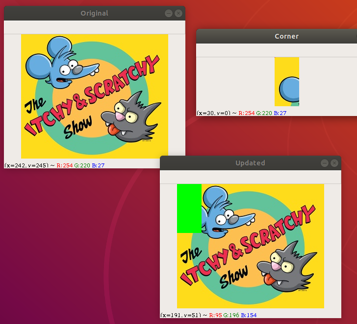
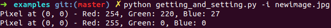

# Listing 3.1

[load_display_save.py](examples/load_display_save.py)

al probar el script con python3 y satisfaciendo los argumentos:

```
python3 load_display_save.py -i images/The_.png
```

nos muestra una ventana con la imagen que le pasamos:



la ventana es interactiva, si desplazamos el mouse por arriba, nos mostrara posicion del cursor (x, y) y tambien el color RGB del pixel apuntado


# Listing 4.1

aca consultamos y seteamos los pixeles en formato RGB, lo mas destacable de este ejemplo es que opencv storea el color de los pixeles como BGR (blue, green, red)

por cada llamada a cv2.imshow nos levanta una ventanita como la del ejemplo anterior

[getting_and_setting.py](examples/getting_and_setting.py)

otra cosa rara de la libreria esta, es que si miramos la siguiente zona:

``` python
corner = image[0:100, 0:50]
cv2.imshow("Corner", corner)
```

0:100 y 0:50 son rangos de pixeles, lo raro es que uno esta acostumbrado al estilo (x, y), sin embargo estos de opencv usan (y, x)

aca apreciamos como quedan los cuadraditos, notar los ejes x e y:



y tambien podemos notar lo facil que es settear y gettear los colores de los pixeles




